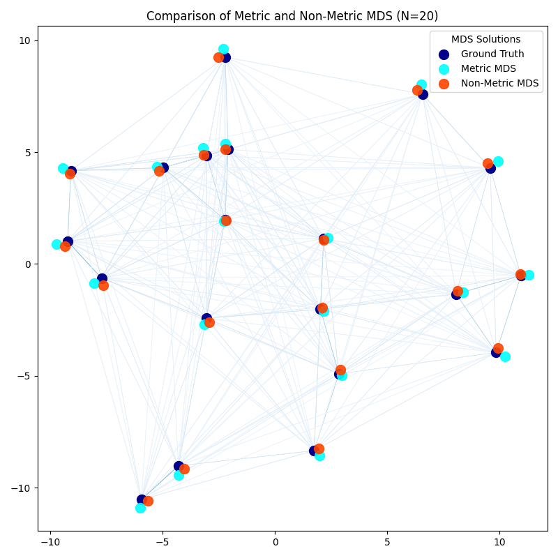

# Multi-dimensional Scaling (MDS) Comparative Analysis

## Metric vs. Non-Metric MDS: Reconstructing Spatial Structure from Dissimilarities

This repository features a robust Python implementation designed to illustrate and compare the fundamental differences between **Metric (Classical) Multi-dimensional Scaling** and **Non-Metric Multi-dimensional Scaling (NMDS)**.

MDS is a technique for visualization and dimensionality reduction that seeks to map objects into a low-dimensional space (typically 2D or 3D) such that the distances between them in the new space correspond as closely as possible to their original input dissimilarities.

---

## The Project and Its Motivation

### Background: Why Compare Metric and Non-Metric MDS?

1.  **Metric MDS (Classical MDS):** This method assumes that the input dissimilarities ($\delta_{ij}$) are true metric distances in a Euclidean space. It aims to find a set of points ($x_i$) such that the Euclidean distance $d_{ij}(x_i, x_j)$ is **linearly proportional** to $\delta_{ij}$. It is ideal when the relationship between the dissimilarity and distance is well-known and linear.


2.  **Non-Metric MDS (NMDS):** This approach is more flexible and robust to noise and non-metric data. It focuses only on preserving the **rank-order (ordinal relationship)** of the dissimilarities. NMDS finds a monotonic transformation (non-linear, but strictly non-decreasing) of the dissimilarities ($\hat{d}_{ij}$) to minimize the "stress" between the new space distances ($d_{ij}$) and the original dissimilarity ranking. It is the preferred choice in social sciences, psychology, and biology, where dissimilarities are often ordinal or subjective.

This script visually demonstrates how, when noise is present, NMDS (focused on rank-order) can sometimes yield a more structurally accurate reconstruction than Metric MDS (which attempts to preserve exact magnitudes).

---

## Technical Implementation Details

The project is structured into five main stages to ensure a fair and accurate comparison of the results:

### 1. Data Preparation (Simulation)
* **Generation:** Creates 20 random points in a 2D space (**Ground Truth**).
* **Noise Injection:** Calculates the Euclidean distance matrix and **adds a symmetric, random perturbation (noise)** to this matrix. This noisy matrix is the *sole input* provided to the MDS algorithms.

### 2. MDS Execution
* Both models (`MDS` and `NMDS`) are instantiated using the `scikit-learn` library with the `dissimilarity="precomputed"` option.
    * Metric MDS is executed with the default configuration (`metric=True`).
    * NMDS is explicitly set with `metric=False`.

### 3. Solution Alignment (Crucial for Comparison)
Since MDS/NMDS can arbitrarily rotate or reflect the solution, the axes must be aligned for meaningful visual comparison:
* **Rescaling:** The NMDS result is rescaled to match the overall spread (variance) of the Ground Truth data.
* **PCA Rotation:** Principal Component Analysis (PCA) is applied to the Ground Truth and both MDS results. The principal components serve as a set of orthogonal coordinates to center and align the rotation of all three point clouds.
* **Reflection Correction:** The sign of the correlation between the result axes and the Ground Truth axes is checked. If negative, the axis is inverted (reflected) to ensure consistent orientation.

### 4. Visualization
`Matplotlib` is used to plot:
* The three aligned point clouds (**Ground Truth, Metric MDS, NMDS**).
* A **line collection** (`LineCollection`) connecting the Ground Truth points. The **thickness and color** of these lines are mapped to the inverse of the *input dissimilarity* (the noisy distance matrix), visually representing the strength of the original relationships.

---

## Setup and Usage

### Prerequisites

Ensure you have Python 3.x installed. The following scientific computing libraries are required:

```bash
pip install numpy scikit-learn matplotlib
```
---
# How to Run

Clone the repository:

```bash
git clone https://github.com/WallacehCosta/multidimensional-scaling.git
```
Execute the script
```bash
python mds-implementation-script
```
---
# Expected Output

The execution will generate a figure that directly compares the three spatial representations. Observe the accuracy of 
each method in attempting to maintain the geometric structure of the original points, especially under the influence
of the introduced noise.



The chart compares the Ground Truth (true position) with the two MDS reconstructions. The connecting lines represent 
the strength of the dissimilarity (noisy input distance), allowing a visual assessment of how each method preserves 
the structure.
---
# Contributions

Feel free to open issues or submit pull requests to improve the code, add stress metrics, or expand the analysis to 
other embedding techniques.

- Contact email: holandawallacecosta@gmail.com
